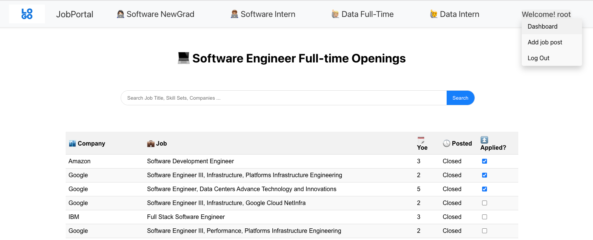

# Job Portal

A React-based web application for job seekers and employers to connect. This platform allows new graduates and interns to find software engineering positions and facilitates employers in posting job openings.

## Features

- User authentication with login and register functionalities.
- Role-based access control with separate views for admin and regular users.
- Job listings for new graduates and interns.
- Search functionality for job listings based on various parameters.
- Ability for users to apply to jobs and view their applied job list.
- Admin functionality to post new job listings.

## Getting Started

These instructions will get you a copy of the project up and running on your local machine for development and testing purposes.

### Prerequisites

- Node.js
- npm or yarn
- A modern web browser

### Installing

1. Clone the repository to your local machine:

   ```sh
   git clonehttps://github.com/kou5321/JobPortalWebsite-frontend.git
   ```

Navigate to the cloned directory:

   ```sh
   cd JobPortalWebsite-frontend
   ```

Install the necessary dependencies:

   ```sh
   npm install
   ```
   
Start the development server:

```sh
npm start
```
Open your web browser and navigate to:

http://localhost:3000

## Built With
- React - The web framework used.
- axios - Promise based HTTP client for making requests.
- react-router-dom - For routing and navigation.

## demo pic


## Acknowledgement 
This project's design was inspired by the layout and functionality of [JobPulse](http://www.jobpulse.fyi), with the aim to create a tailored job search experience for new graduates and interns in the tech industry.

